# Sabor Académico 2024 🍽

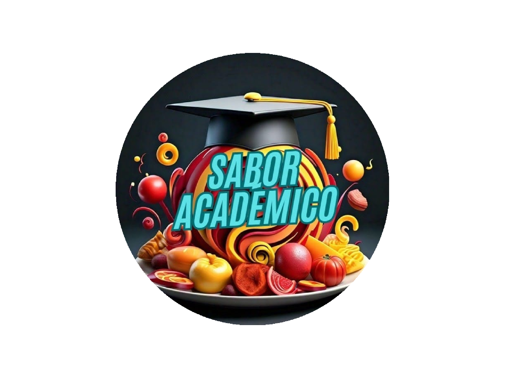

## ¿Qué es? 📲
Sabor Académico es una aplicación móvil diseñada para la gestión y administración de pedidos en un restaurante. Ofrece a los clientes la posibilidad de registrarse y realizar sus pedidos al llegar al local, agilizando todo el proceso. Desde el momento en que el cliente realiza su pedido, la aplicación gestiona la asignación de mesas, la derivación de los pedidos a los sectores correspondientes, como cocina y bar, y el seguimiento de la preparación por parte del equipo de cocineros. Además, permite que los clientes realicen el pago de manera rápida y sencilla, ofreciendo una excelente experiencia gastronómica.

## Grupo 🧠
- **[Alfa]** [Monserrat, Lautaro](https://github.com/llauu)
- **[Beta]** [Faccini, Trinidad](https://github.com/trinifaccini)
- **[Gamma]** [Rodriguez, Julian](https://github.com/rodriguezjulian)

## Asignación de tareas 📑
| #  | Tarea                                                   | Responsable | Estado    |
| -- | ------------------------------------------------------- | ----------- | --------- |
| 1  | Generacion de proyecto                                  | Beta        | Terminado |
| 2  | Icono y Splash Screen                                   | Gamma       | Terminado |
| 3  | Inicio de sesion                                        | Alfa        | Terminado |
| 4  | Inicio                                                  | Alfa        | Terminado |
| 5  | Sonidos de inicio y salida                              | Gamma       | Terminado |
| 6  | Spinner personalizado                                   | Gamma       | Terminado |
| 7  | Alta cliente                                            | Gamma       | Terminado |
| 8  | Habilitacion de cliente                                 | Gamma       | Terminado |
| 9  | Menu supervisor/dueño                                   | Gamma       | Terminado |
| 10 | Menu empleados                                          | Gamma       | Terminado |
| 11 | Menu maitre                                             | Alfa        | Terminado |
| 12 | Menu mozo                                               | Gamma       | Terminado |
| 13 | Menu clientes                                           | Alfa        | Terminado |
| 14 | QR del DNI                                              | Beta        | Terminado |
| 15 | QR de ingreso al local                                  | Beta        | Terminado |
| 16 | QR de la mesa                                           | Beta        | Terminado |
| 17 | QR de propina                                           | Beta        | Terminado |
| 18 | Ingresar al local                                       | Beta        | Terminado |
| 19 | Listado de espera                                       | Beta        | Terminado |
| 20 | Encuesta de satisfaccion al cliente                     | Alfa        | Terminado |
| 21 | Graficos de encuestas de clientes                       | Alfa        | Terminado |
| 22 | Pedir platos y bebidas (menu)                           | Beta        | Terminado |
| 23 | Manejo del estado del pedido                            | Beta        | Terminado |
| 24 | Confirmar pedido                                        | Gamma       | Terminado |
| 25 | Pedir la cuenta                                         | Alfa        | Terminado |
| 26 | Metodos y simulacion de pago                            | Alfa        | Terminado |
| 27 | Mozo confirma pago                                      | Gamma       | Terminado |
| 28 | Consulta al mozo (chat)                                 | Alfa        | Terminado |
| 29 | Correo Auto. para Pendiente/Rechazado/Aceptado          | Gamma       | Terminado |
| 30 | Correo Perso. para Pendiente/Rechazado/Aceptado         | Gamma       | Terminado |
| 31 | Push N. / Manejo de tokens                              | Alfa        | Terminado |
| 32 | Push N. / Cliente nuevo (al dueño y supervisor)         | Alfa        | Terminado |
| 33 | Push N. / Ingreso al local (al maitre)                  | Alfa        | Terminado |
| 34 | Push N. / Asignacion de mesa (al cliente)               | Alfa        | Terminado |
| 35 | Push N. / Consulta al mozo (chat, al mozo)              | Alfa        | Terminado |
| 36 | Push N. / Aviso de pedido nuevo (a los sectores)        | Alfa        | Terminado |
| 37 | Push N. / Producto listo (al mozo)                      | Alfa        | Terminado |
| 38 | Push N. / Cliente solicita cuenta (al mozo)             | Alfa        | Terminado |

## Fecha de inicio 📆
El proyecto fue **iniciado** el día 29 de octubre de 2024.

## Fecha de finalizacion 📆
El proyecto fue **finalizado** el día 18 de noviembre de 2024.

## Ramas 🌿
### Principal
- **main**  Es la versión principal donde estaremos manejando las versiones finales del proyecto.

### Secundarias
Utilizaremos ramas secundarias para desarrollar distintas funcionalidades del proyecto de forma segura, evitando riesgos en la rama principal en caso de que ocurra algún error irreversible.
- **Gamma**  Las ramas comenzadas con "_JR__" seran pertenecientes a los avances desarrollados por el integrante _Gamma_.
- **Alfa**  Las ramas comenzadas con "_LM__" seran pertenecientes a los avances desarrollados por el integrante _Alfa_.
- **Beta**  Trabajará en la rama "_menu_" para desarrollar y probar nuevas funcionalidades de forma independiente. Una vez comprobado su correcto funcionamiento, integrará los cambios directamente en la rama "_main_".

## Secciones 📃
### Inicio de sesión y Registros
| Inicio de sesión                                | Registro                                      | Registro de anónimo                                     |
| ----------------------------------------------- | --------------------------------------------- | ------------------------------------------------------- |
| 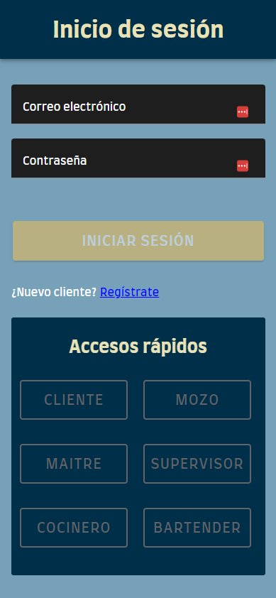 | 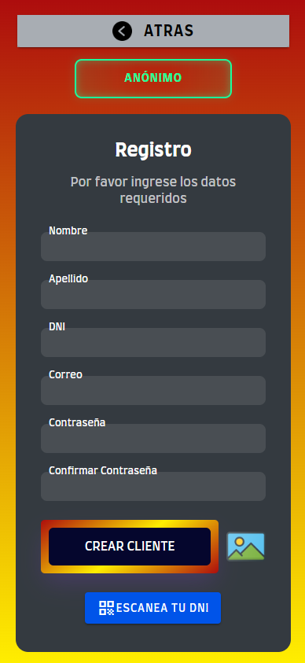 | 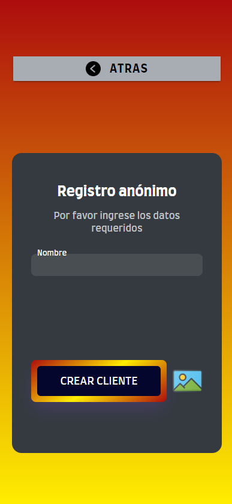 |

### Menu empleados
| Menu cocineros                                               | Menu maitre                                      | Menu supervisor/dueño                                   |
| ------------------------------------------------------------ | ------------------------------------------------ | ------------------------------------------------------- |
| 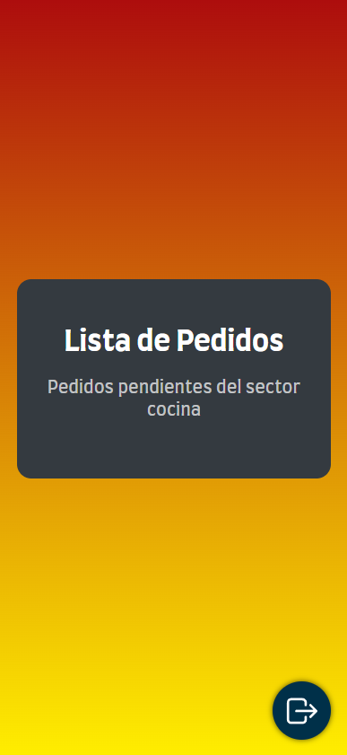 | 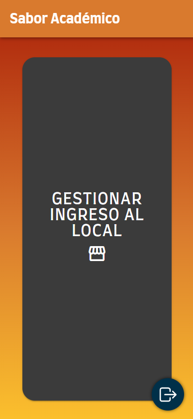 | 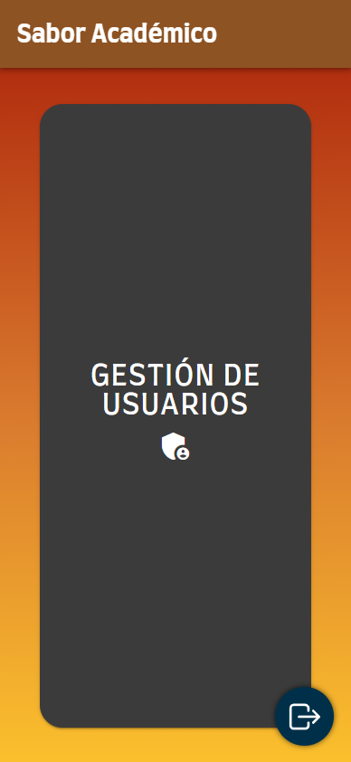 |

### Menu mozo
| Menu mozo                                           | Menu maitre                                      | Menu supervisor/dueño                                   |
| --------------------------------------------------- | ------------------------------------------------ | ------------------------------------------------------- |
| 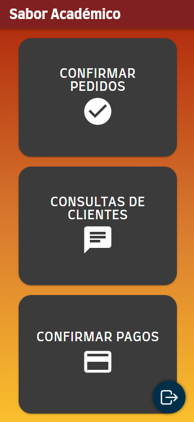 |  |  |

### Menu cliente
| Menu cliente                                           | Menu                                      | Ver encuestas                                              |
| ------------------------------------------------------ | ----------------------------------------- | ---------------------------------------------------------- |
|  | 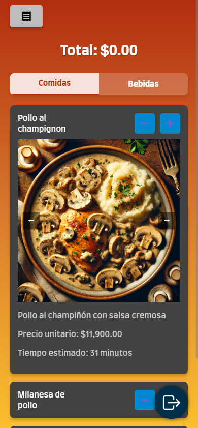 | 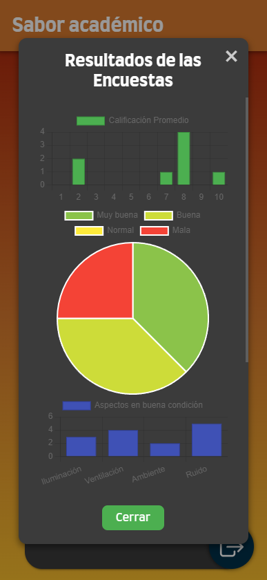 |

## QR's 🌐
### - **Ingreso al local**
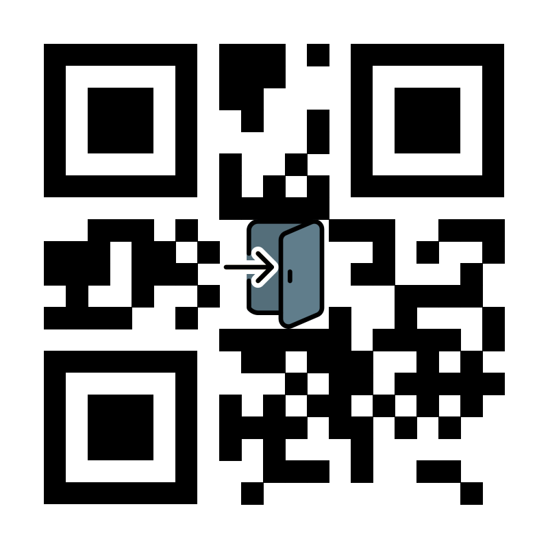

### - **Mesa uno**
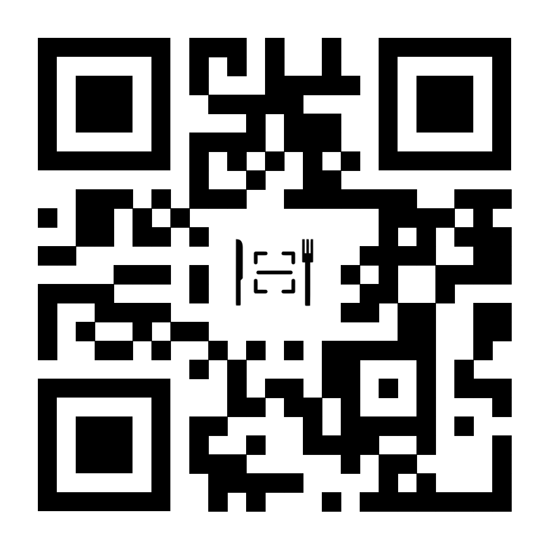

### - **Mesa dos**
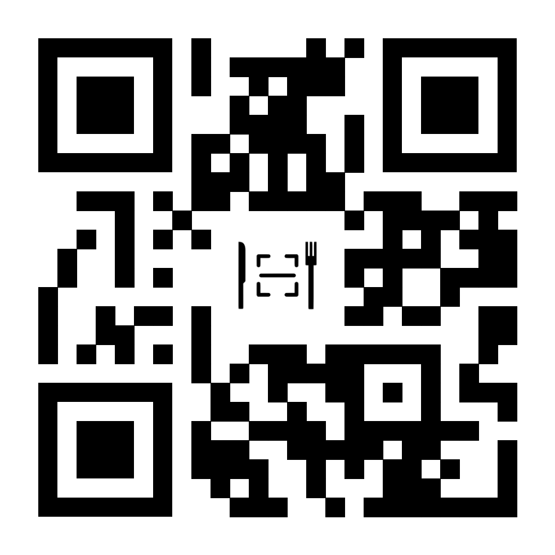

### - **Mesa tres**
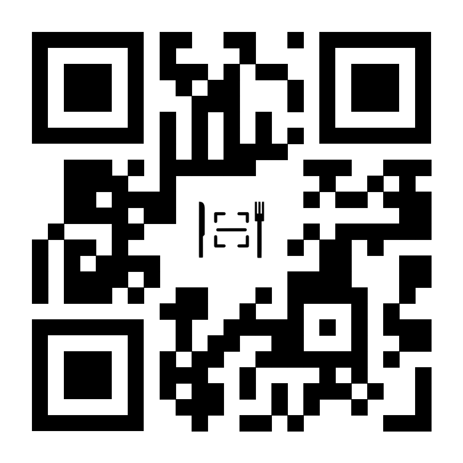

### - **Propina servicio excelente**
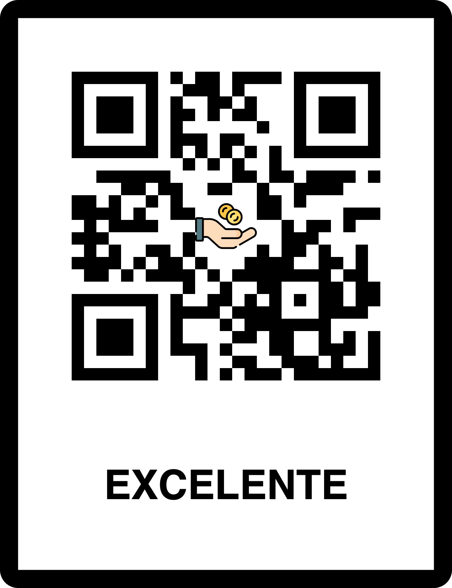

### - **Propina servicio muy bueno**
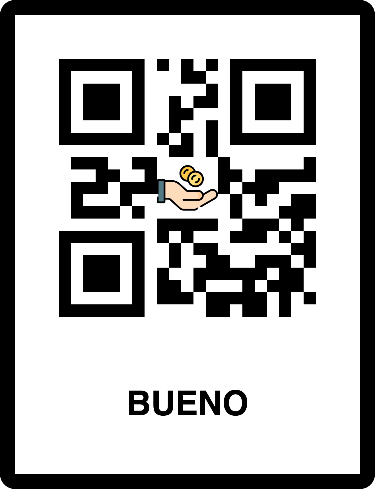

### - **Propina servicio bueno**

### - **Propina servicio malo**
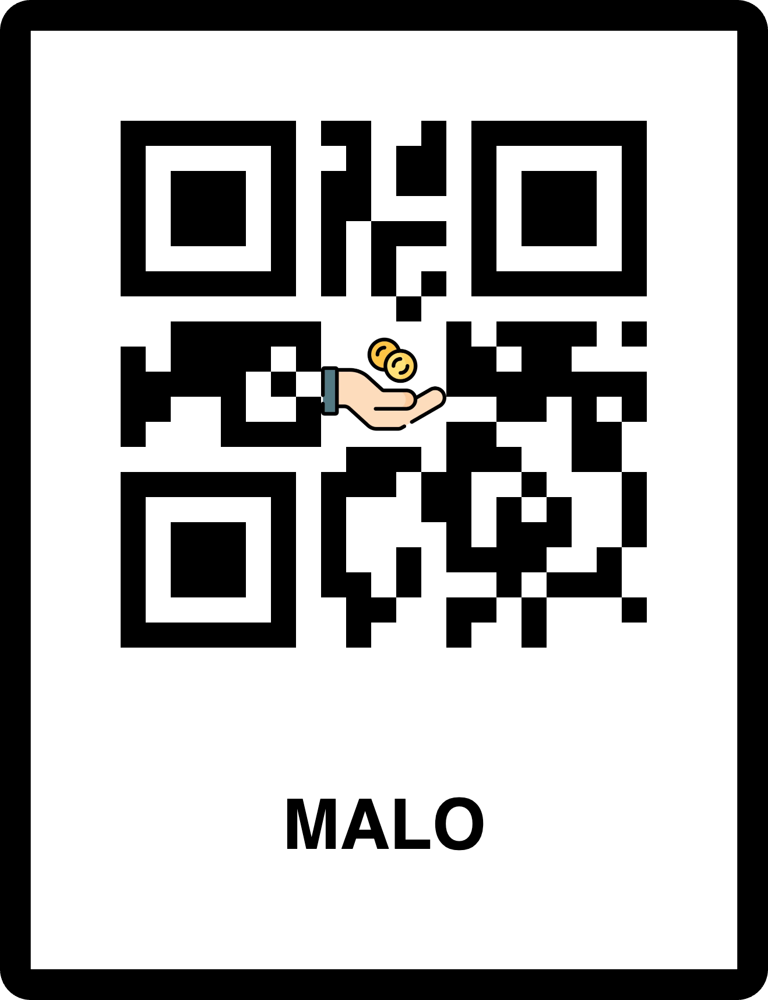